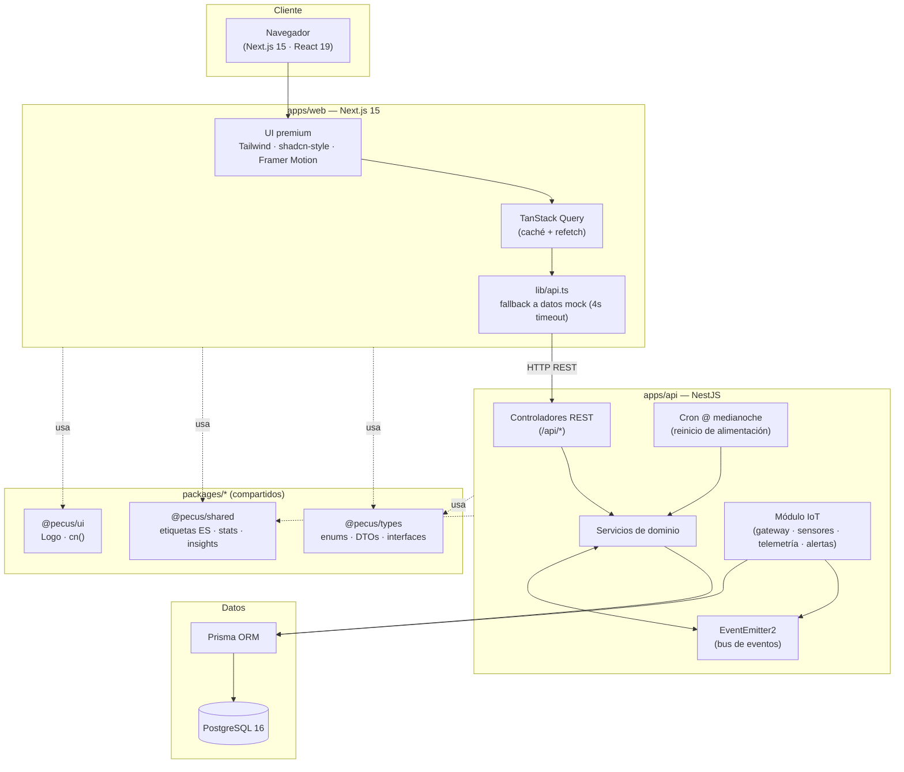
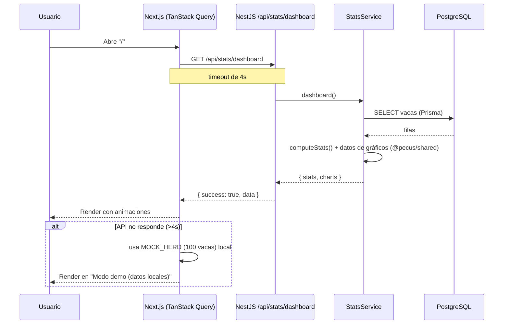
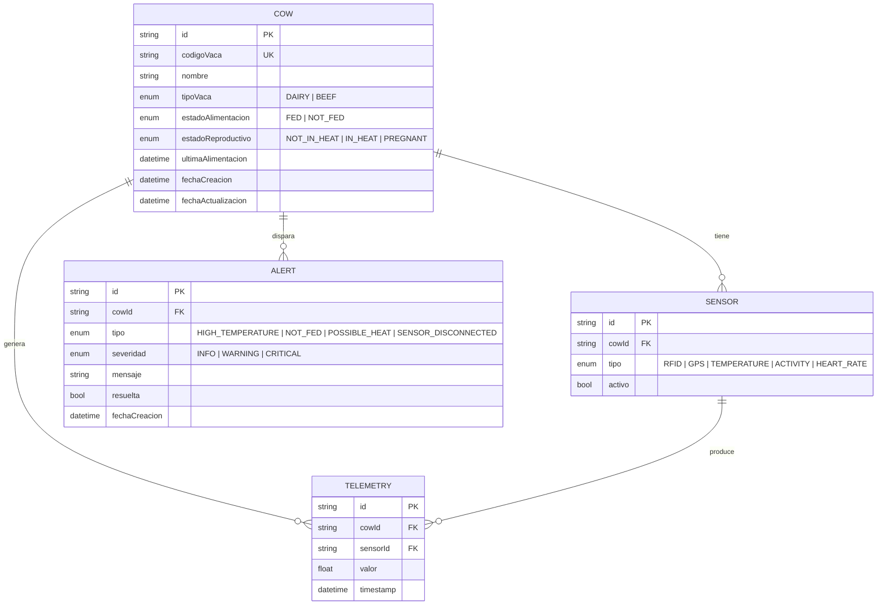

# Arquitectura — PECUS

> Plataforma inteligente de monitoreo y gestión ganadera bovina.

PECUS es un **monorepo** que reúne un frontend Next.js 15, un backend NestJS, una
capa de datos Prisma/PostgreSQL y una arquitectura **IoT simulada** lista para
conectarse a sensores reales vía MQTT. Todo orquestable con Docker Compose.

---

## 1. Vista general



---

## 2. Estructura del monorepo

```
PECUS/
├── apps/
│   ├── web/                  # Next.js 15 (App Router, RSC, standalone)
│   │   ├── src/app/          # Rutas: /, /dairy, /beef, /insights, /cows/*
│   │   ├── src/components/   # ui · layout · dashboard · cows
│   │   ├── src/lib/          # api · hooks · mock-data · utils
│   │   └── e2e/              # Playwright (smoke tests)
│   └── api/                  # NestJS (REST + Swagger + IoT)
│       ├── src/cows/         # CRUD de ganado
│       ├── src/feeding/      # Alimentación + cron de reinicio
│       ├── src/reproduction/ # Estado reproductivo
│       ├── src/stats/        # Dashboard agregado
│       ├── src/insights/     # Smart Insights (reglas)
│       ├── src/iot/          # gateway · sensor · telemetry · alerts · events
│       └── src/common/       # filtros · interceptores · DTOs
├── packages/
│   ├── types/                # @pecus/types  (contrato de tipos)
│   ├── shared/               # @pecus/shared (lógica/etiquetas comunes)
│   └── ui/                   # @pecus/ui     (Logo, helper cn)
├── database/
│   ├── prisma/schema.prisma  # Modelos Cow · Sensor · Telemetry · Alert
│   └── seed/seed.ts          # 100 vacas (50 lecheras + 50 carne)
├── docker/                   # Recursos de contenedores
├── docs/                     # Esta documentación
├── tests/                    # Recursos E2E a nivel raíz
└── .github/workflows/ci.yml  # CI: lint · test · build · e2e · playwright
```

El monorepo usa **pnpm workspaces** + **Turborepo**. Los paquetes `@pecus/*` se
consumen vía `workspace:*` y Next.js los transpila con `transpilePackages`.

---

## 3. Capas y responsabilidades

| Capa | Tecnología | Responsabilidad |
|------|-----------|-----------------|
| Presentación | Next.js 15, React 19, Tailwind, Framer Motion | UI, dark mode, animaciones, gráficos |
| Estado cliente | TanStack Query | Caché, refetch en intervalos, mutaciones optimistas |
| Resiliencia | `lib/api.ts` + `lib/mock-data.ts` | Degradación a datos locales si el API no responde |
| API | NestJS, Swagger | Endpoints REST, validación, documentación |
| Dominio | Servicios Nest + `@pecus/shared` | Reglas de negocio, estadísticas, insights |
| Eventos | EventEmitter2 | Desacople: telemetría → alertas → logs |
| IoT | Gateway + servicios Nest | Simulación de sensores, ingestión, MQTT-ready |
| Persistencia | Prisma + PostgreSQL | Modelado relacional, migraciones, seed |
| Contratos | `@pecus/types` | Fuente única de verdad de tipos y DTOs |

---

## 4. Flujo de una petición (lectura del dashboard)



---

## 5. Modelo de datos



---

## 6. Decisiones de diseño

- **Componentes UI hechos a mano (estilo shadcn):** en lugar de instalar shadcn/ui
  vía CLI (que arrastra Radix y es frágil en entornos sin red), se escribieron
  componentes ligeros con Tailwind + `class-variance-authority`. El `Select` es
  nativo estilizado (100% compatible con React Hook Form).
- **Resiliencia para la demo:** el frontend nunca se queda en blanco. Si el API no
  responde en 4 s, usa un hato mock determinístico (PRNG *mulberry32*, semilla
  2025) y muestra el badge **"Modo demo (datos locales)"**.
- **Eventos sobre acoplamiento directo:** la telemetría emite eventos que el
  módulo de alertas consume con `@OnEvent`, evitando dependencias rígidas.
- **Contrato de tipos centralizado:** `@pecus/types` es la única fuente de verdad,
  compartida por frontend y backend, evitando *drift* entre cliente y servidor.
- **Tipografía distintiva:** Outfit (display) + Plus Jakarta Sans (texto), para
  alejarse de la estética genérica.

---

## 7. Seguridad

- **Helmet** para cabeceras HTTP seguras.
- **CORS** restringido a `CORS_ORIGIN` (por defecto `http://localhost:3000`).
- **ValidationPipe global** (`whitelist` + `transform`) que rechaza propiedades no
  declaradas y castea DTOs automáticamente.
- **Filtro de excepciones** uniforme: `{ success: false, statusCode, path, ... }`.
- **Interceptor de transformación**: envuelve toda respuesta en
  `{ success: true, data }` preservando metadatos de paginación.

Ver también [`api.md`](./api.md) y [`iot.md`](./iot.md).
