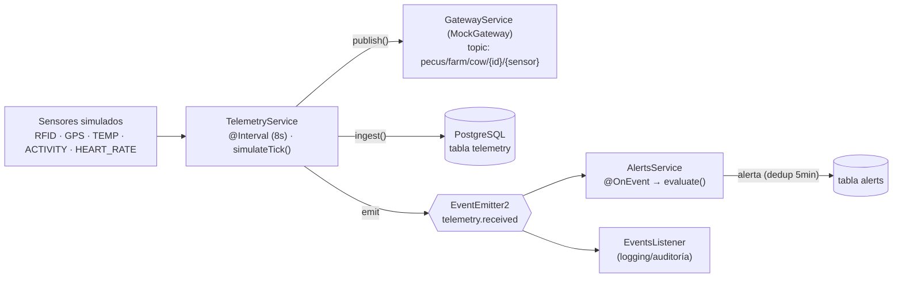
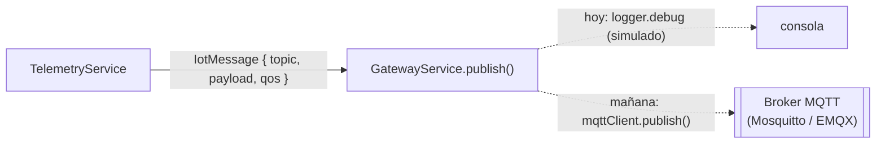
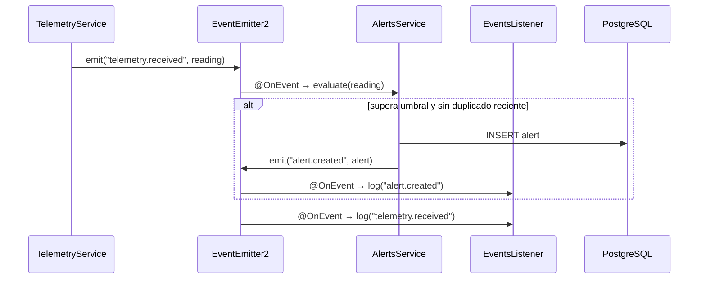

# Arquitectura IoT — PECUS

PECUS incluye una **arquitectura IoT simulada** que reproduce el ciclo completo de
una plataforma de telemetría ganadera real — *sensores → gateway → ingestión →
persistencia → reglas de alerta → eventos* — diseñada para sustituir la simulación
por un broker **MQTT** real sin reescribir la lógica de negocio.

---

## 1. Flujo de telemetría



El método `ingest()` es el **punto de entrada único** (lo usan tanto la simulación
como el endpoint `POST /api/iot/telemetry/ingest`): persiste la lectura, la publica
en el gateway y emite el evento `telemetry.received`.

---

## 2. Componentes

| Componente | Archivo | Rol |
|-----------|---------|-----|
| Interfaces y umbrales | `iot/interfaces/iot.interfaces.ts` | `SensorReading`, `IotMessage`, `TelemetryTransport`, `IOT_THRESHOLDS`. |
| Gateway | `iot/gateway/gateway.service.ts` | Implementa `TelemetryTransport`. Hoy *mock*, mañana cliente MQTT. |
| Sensores | `iot/sensor/*` | Catálogo y consulta de sensores por vaca. |
| Telemetría | `iot/telemetry/*` | Simulación periódica + ingestión + publicación + evento. |
| Alertas | `iot/alerts/*` | Evalúa lecturas contra reglas y crea alertas (con deduplicación). |
| Eventos | `iot/events/events.listener.ts` | Escucha y registra eventos del dominio (auditoría). |

---

## 3. Topología de mensajes (MQTT-ready)

El gateway ya genera *topics* con la convención de un broker real:

```
pecus/farm/cow/{cowId}/{sensor}
                       └─ temperature | activity | gps | rfid | heart_rate
```



Migrar a MQTT real solo requiere reemplazar el cuerpo de `publish()` por una
llamada al cliente MQTT — el contrato `TelemetryTransport` permanece intacto.

---

## 4. Reglas de alerta

Evaluadas en `AlertsService.evaluate()` sobre cada lectura recibida:

| Condición | Tipo de alerta | Severidad |
|-----------|----------------|-----------|
| `TEMPERATURE` ≥ **39.5 °C** | `HIGH_TEMPERATURE` | `CRITICAL` |
| `ACTIVITY` ≥ **80** (índice) | `POSSIBLE_HEAT` | `WARNING` |

Umbrales centralizados en `IOT_THRESHOLDS` para ajuste sencillo:

```ts
export const IOT_THRESHOLDS = {
  TEMPERATURE_HIGH_C: 39.5,
  HEART_RATE_HIGH_BPM: 90,
  ACTIVITY_HEAT_IDX: 80,
  BATTERY_LOW: 20,
} as const;
```

**Deduplicación:** antes de crear una alerta se comprueba que no exista otra del
mismo tipo para la misma vaca en los últimos **5 minutos**, evitando ruido cuando
varias lecturas consecutivas superan el umbral.

---

## 5. Bus de eventos

`EventEmitter2` (con *wildcards* y delimitador `.`) desacopla los módulos. Eventos
definidos en `@pecus/types` (`PECUS_EVENTS`):

| Evento | Emisor | Consumidor |
|--------|--------|-----------|
| `telemetry.received` | TelemetryService | AlertsService, EventsListener |
| `alert.created` | AlertsService | EventsListener |
| `feeding.updated` | FeedingService | EventsListener |
| `feeding.reset.completed` | Cron de medianoche | EventsListener |
| `reproduction.updated` | ReproductionService | EventsListener |



---

## 6. Configuración

| Variable | Por defecto | Efecto |
|----------|-------------|--------|
| `IOT_SIMULATION_ENABLED` | `true` | Activa/desactiva la simulación de telemetría. |
| `IOT_SIMULATION_INTERVAL_MS` | `8000` | Periodo del `simulateTick()` (ms). |

En CI la simulación se desactiva (`IOT_SIMULATION_ENABLED=false`) para que las
pruebas sean deterministas.

---

## 7. Camino a producción

1. **Broker:** desplegar Mosquitto/EMQX y reemplazar el cuerpo de
   `GatewayService.publish()` por `mqttClient.publish(topic, payload)`.
2. **Ingreso real:** suscribir un consumidor a `pecus/farm/cow/+/+` que llame a
   `TelemetryService.ingest()` con cada mensaje recibido.
3. **Escalado:** mover la persistencia de telemetría a una base de series
   temporales (TimescaleDB) si el volumen lo requiere.
4. **Más reglas:** añadir condiciones a `evaluate()` (frecuencia cardíaca,
   sensor desconectado, batería baja) reutilizando `IOT_THRESHOLDS`.

Ver también [`architecture.md`](./architecture.md) y [`api.md`](./api.md).
